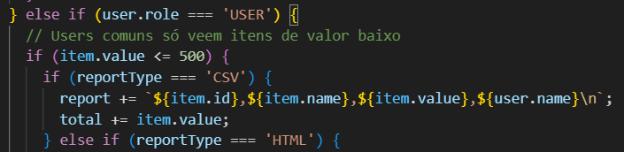
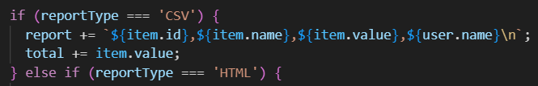
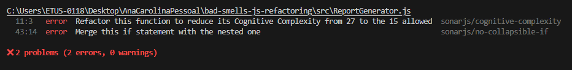
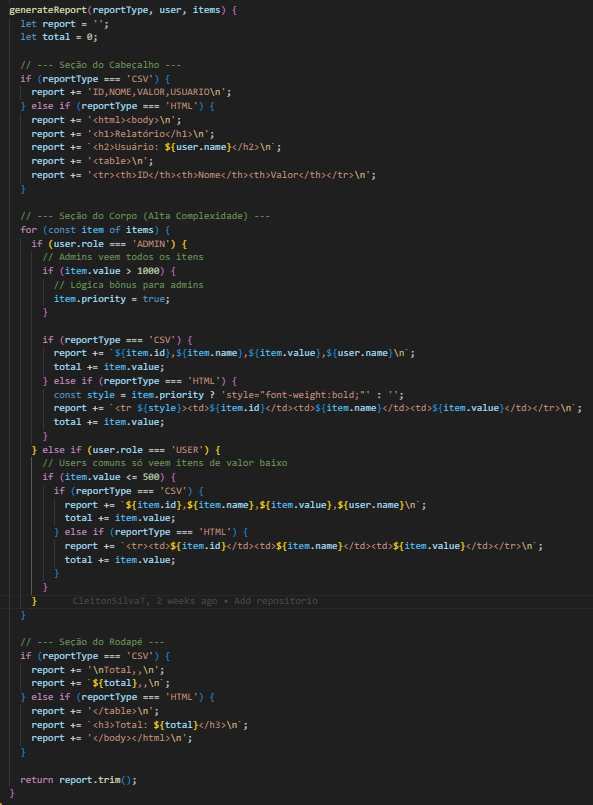

# Relatório de Refatoração e Bad Smells

## Análise e Melhoria da Qualidade de Código através de Refatoração

**Disciplina:** Teste de Software  
**Trabalho:** Refatoração e Bad Smells  
**Aluno:** Ana Carolina Caldas de Mello  
**Matrícula:** 801198  
**Data:** Novembro de 2024

---

## 1. Análise de Bad Smells

### 1.1 Bad Smell 1: Método Longo (Long Method)

**Localização:** `src/ReportGenerator.js`, método `generateReport`, linha 11

**Descrição do Problema:**

O método `generateReport` possui uma complexidade cognitiva de 27, quando o limite recomendado é 15. Isso ocorre porque o método concentra múltiplas responsabilidades.

**Por que é problemático:**

1. **Manutenção:** Qualquer alteração requer entender toda a lógica do método, aumentando o risco de introduzir bugs
2. **Testes:** Dificulta a criação de testes unitários específicos, pois não é possível testar cada responsabilidade isoladamente
3. **Legibilidade:** O código se torna difícil de entender, especialmente para novos desenvolvedores
4. **Reutilização:** Lógica duplicada não pode ser reutilizada em outros contextos

**Impacto nos Testes:**

Testes precisam cobrir múltiplos cenários em um único método, tornando-os mais frágeis e difíceis de manter. Qualquer mudança no método pode quebrar vários testes.

---

### 1.2 Bad Smell 2: Múltiplos if/else

**Localização:** `src/ReportGenerator.js`, linhas 43-54

**Descrição do Problema:**

O código apresenta condicionais aninhadas desnecessárias:

**Por que é problemático:**

1. **Manutenção:** Condicionais aninhadas aumentam a complexidade ciclomática
2. **Testes:** Cada nível de aninhamento aumenta exponencialmente o número de casos de teste necessários
3. **Legibilidade:** A lógica fica menos clara e mais difícil de seguir
4. **Bugs:** Maior probabilidade de erros lógicos, especialmente com condições negadas

**Impacto nos Testes:**

Testes precisam cobrir todas as combinações de condições aninhadas, aumentando a complexidade da suíte de testes e o esforço de manutenção.

---

### 1.3 Bad Smell 3: Duplicação de Código (Code Duplication)

**Localização:** `src/ReportGenerator.js`, múltiplas seções

**Descrição do Problema:**

O código apresenta duplicação significativa em várias áreas:

1. **Formatação de itens:** Lógica similar para CSV e HTML (linhas 35-42 e 46-52)
2. **Geração de cabeçalho/rodapé:** Estrutura condicional repetida para CSV e HTML
3. **Cálculo de totais:** Lógica duplicada em ambos os branches (CSV e HTML)

**Exemplo de Duplicação:**

**Por que é problemático:**

1. **Manutenção:** Correções e melhorias precisam ser aplicadas em múltiplos lugares, aumentando o risco de inconsistências
2. **Testes:** Código duplicado requer testes duplicados, aumentando o esforço de manutenção
4. **Evolução:** Adicionar novos formatos (ex: JSON, XML) requer duplicar ainda mais código

**Impacto nos Testes:**

Testes precisam verificar o mesmo comportamento em múltiplos contextos, aumentando a redundância e o risco de testes desatualizados quando o código é modificado.

---

## 2. Relatório da Ferramenta

### 2.1 Execução do ESLint

Ao executar `npx eslint src/` no código original, obtive-se os seguintes resultados:

### 2.2 Contribuição do eslint-plugin-sonarjs

O `eslint-plugin-sonarjs` foi fundamental para identificar problemas que poderiam passar despercebidos em uma análise manual:

1. **Complexidade Cognitiva Quantificada:** 
   - A análise manual poderia identificar que o método é "complexo", mas não quantificar que a complexidade (27) é quase o dobro do limite recomendado (15)
   - A ferramenta fornece uma métrica objetiva e acionável

2. **Detecção Automática de Condicionais Colapsáveis:**
   - A regra `no-collapsible-if` identificou automaticamente condicionais que podem ser simplificadas
   - Em uma revisão manual, essa otimização poderia ser negligenciada ou não percebida

3. **Prevenção de Problemas Futuros:**
   - A ferramenta não apenas identifica problemas existentes, mas também previne a introdução de novos problemas similares

**Conclusão:** O uso de ferramentas automatizadas como o `eslint-plugin-sonarjs` complementa a análise manual, fornecendo métricas objetivas e detectando padrões problemáticos que podem não ser óbvios em uma primeira leitura do código.

---

## 3. Processo de Refatoração

### 3.1 Bad Smell Escolhido: Complexidade Cognitiva Alta e Duplicação de Código

Escolheu-se abordar a **Complexidade Cognitiva Alta/Método Longo** como o mais crítico, pois ele engloba e agrava os outros problemas. A refatoração também resolveu a duplicação de código e simplificou as condicionais.

### 3.2 Técnicas de Refatoração Aplicadas

#### 3.2.1 Extract Method

**Objetivo:** Quebrar o método longo em métodos menores e mais focados.

**Aplicação:**
- Criação de `generateHeader()` para gerar o cabeçalho
- Criação de `generateBody()` para processar os itens
- Criação de `generateFooter()` para gerar o rodapé
- Criação de `formatItem()` para formatar um item

#### 3.2.2 Replace Conditional with Polymorphism

**Objetivo:** Eliminar condicionais baseadas em tipo usando polimorfismo.

**Aplicação:**
- Criou-se uma classe base `Generator` com métodos abstratos
- Criou-se `CsvGenerator` e `HtmlGenerator` que estendem `Generator`
- Cada classe implementa sua própria lógica de formatação
- O `ReportGenerator` usa polimorfismo para escolher o gerador apropriado

### 3.3 Código Antes da Refatoração

**Problemas identificados:**
- Complexidade Cognitiva: 27 (limite: 15)
- Condicionais colapsáveis aninhadas
- Duplicação de código para CSV e HTML
- Múltiplas responsabilidades em um único método

### 3.4 Código Depois da Refatoração

**Melhorias alcançadas:**
- Complexidade Cognitiva: Reduzida significativamente (cada método agora tem responsabilidade única)
- Eliminação de duplicação: Lógica comum na classe base, específica nas filhas
- Simplificação de condicionais: Uso de polimorfismo elimina condicionais baseadas em tipo
- Separação de responsabilidades: Cada classe tem uma única responsabilidade
- Facilidade de extensão: Adicionar novos formatos requer apenas criar uma nova classe

---

## 4. Conclusão

### 4.1 Importância dos Testes como Rede de Segurança

Esse trabalho demonstrou claramente a importância de ter uma suíte de testes robusta antes de iniciar uma refatoração. Eles funcionaram como uma **rede de segurança**, permitindo mudanças significativas na estrutura do código com confiança, sabendo que qualquer problema na saída seria detectado imediatamente. Sem os testes, a refatoração seria muito mais arriscada e provavelmente introduziria bugs.

### 4.2 Impacto da Redução de Bad Smells

A redução dos bad smells melhorou significativamente a qualidade do software:

1. **Manutenibilidade:**
   - Código mais fácil de entender e modificar
   - Mudanças futuras serão mais simples e seguras
   - Menor probabilidade de introduzir bugs

2. **Testabilidade:**
   - Código mais fácil de testar
   - Testes mais focados e menos frágeis
   - Maior cobertura com menos esforço

3. **Extensibilidade:**
   - Adicionar novos formatos de relatório é trivial (apenas criar uma nova classe)
   - Arquitetura preparada para crescimento

4. **Qualidade Geral:**
   - Código mais limpo e profissional
   - Menor complexidade cognitiva
   - Melhor separação de responsabilidades
   - Código mais alinhado com princípios SOLID

### 4.3 Lições Aprendidas

1. **Ferramentas Automatizadas são Essenciais:** O `eslint-plugin-sonarjs` identificou problemas que poderiam passar despercebidos
2. **Testes Antes de Refatorar:** Ter testes robustos é pré-requisito para refatoração segura
3. **Refatoração Incremental:** Quebrar problemas grandes em problemas menores facilita a resolução
4. **Padrões de Design Ajudam:** Uso de polimorfismo e herança resolveu múltiplos problemas simultaneamente

### 4.4 Reflexão Final

A refatoração não é apenas sobre "limpar código", mas sobre **melhorar a qualidade do software de forma sustentável**. Ao eliminar bad smells, criou-se código mais testável, extensível e legível. Essas melhorias foram possíveis por causa dos **testes como rede de segurança**, permitindo mudanças significativas com confiança. Isso demonstra que investir em testes e qualidade de código não é um custo, mas um **investimento** que garante uma maior manutenibilidade, confiabilidade e produtividade da equipe.
